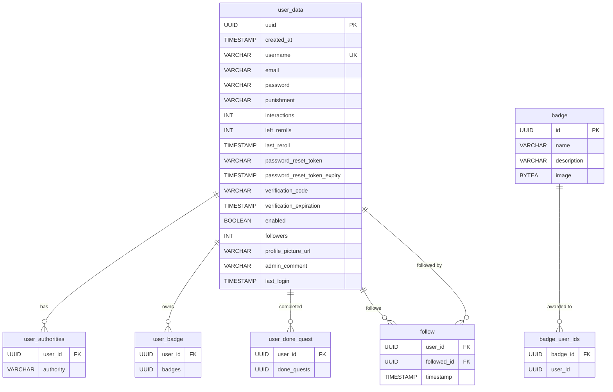
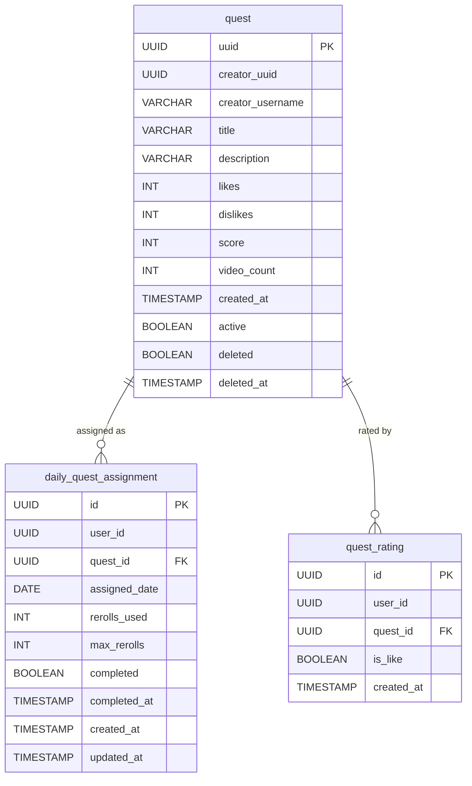
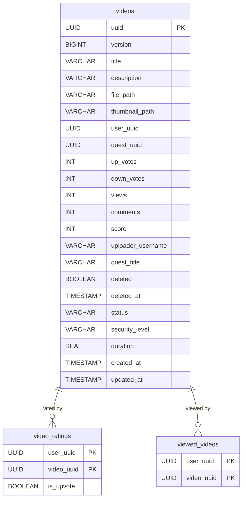
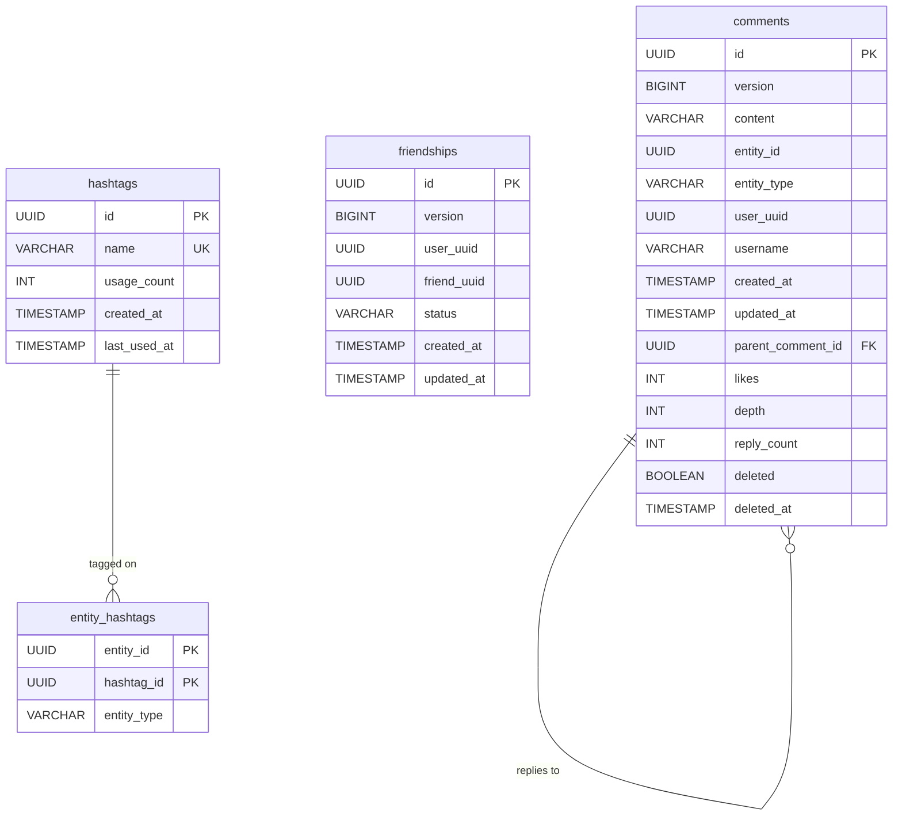
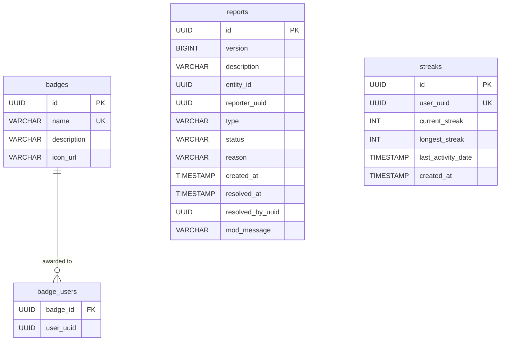
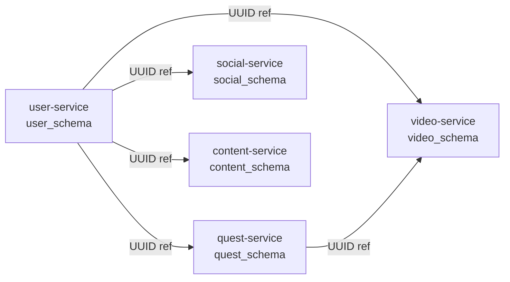

# Data Model

> All services share a single PostgreSQL instance (`dayquest` database) but each service owns its own **schema**, enforced by Flyway and Hibernate's `default_schema` property.

---

## Schema Map

```
dayquest (database)
├── user_schema      → user-service
├── quest_schema     → quest-service
├── video_schema     → video-service
├── social_schema    → social-service
└── content_schema   → content-service
```

> **Note**: Cross-schema foreign keys do not exist. Services reference entities in other schemas only by UUID, preserving loose coupling. Referential integrity across service boundaries is enforced at the application level.

---

## user_schema

Managed by: `user-service` · Migration: `V1__init.sql`



### Key Tables

| Table | Purpose |
|---|---|
| `user_data` | Core user entity — credentials, profile, punishment status |
| `user_authorities` | Roles/authorities (e.g. `ROLE_USER`, `ROLE_ADMIN`) |
| `follow` | Bi-directional follow graph (composite PK) |
| `badge` | Badge definitions (stored in user-service for assignment) |
| `user_badge` | Many-to-many: users ↔ badges |
| `user_done_quest` | Tracks which quests a user has completed |

---

## quest_schema

Managed by: `quest-service` · Migration: `V1__init.sql`



### Key Tables

| Table | Purpose |
|---|---|
| `quest` | Quest entity with scoring and soft-delete |
| `daily_quest_assignment` | One quest per user per day (unique constraint `user_id, assigned_date`) |
| `quest_rating` | Like/dislike per user per quest (unique constraint) |

### Indexes

- `idx_daily_quest_user_date` — primary lookup for today's quest
- `idx_quest_rating_like` — filtered ratings for like/dislike counts

---

## video_schema

Managed by: `video-service` · Migration: `V1__init.sql`



### Key Tables

| Table | Purpose |
|---|---|
| `videos` | Video entity — file paths reference MinIO object keys |
| `video_ratings` | Upvote/downvote per user (composite PK prevents duplicates) |
| `viewed_videos` | View deduplication per user |

### Notable Fields

- `status` — processing state (`PENDING`, `PROCESSING`, `READY`, `FAILED`)
- `security_level` — visibility (`PUBLIC`, `PRIVATE`, etc.)
- `file_path` / `thumbnail_path` — MinIO object keys, not full URLs
- `score` — computed ranking score for feed ordering

---

## social_schema

Managed by: `social-service` · Migration: `V1__init.sql`



### Key Tables

| Table | Purpose |
|---|---|
| `comments` | Polymorphic comments on videos or quests (`entity_id` + `entity_type`) |
| `friendships` | Friend request state machine (`PENDING`, `ACCEPTED`, `BLOCKED`) |
| `hashtags` | Global hashtag registry with usage counts |
| `entity_hashtags` | Polymorphic tag assignment (video, quest, etc.) |

---

## content_schema

Managed by: `content-service` · Migration: `V1__init.sql`



### Key Tables

| Table | Purpose |
|---|---|
| `badges` | Badge definitions (canonical source) |
| `badge_users` | Which users have been awarded which badge |
| `reports` | Content moderation reports (`OPEN` → `RESOLVED`) |
| `streaks` | Per-user daily activity streak tracking |

---

## Cross-Service Data Flow



> Services never query each other's databases directly. Cross-boundary data (e.g. `uploader_username` on `videos`, `creator_username` on `quest`) is **denormalized** at write time to avoid runtime inter-service calls for read-heavy operations.
