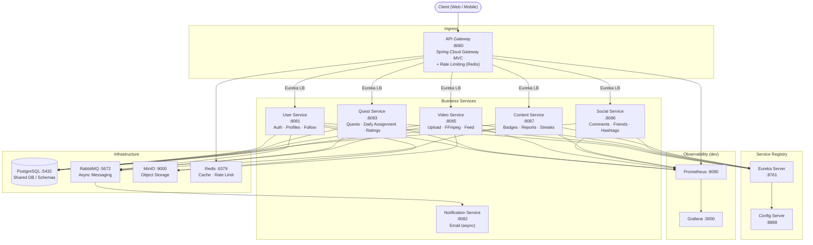
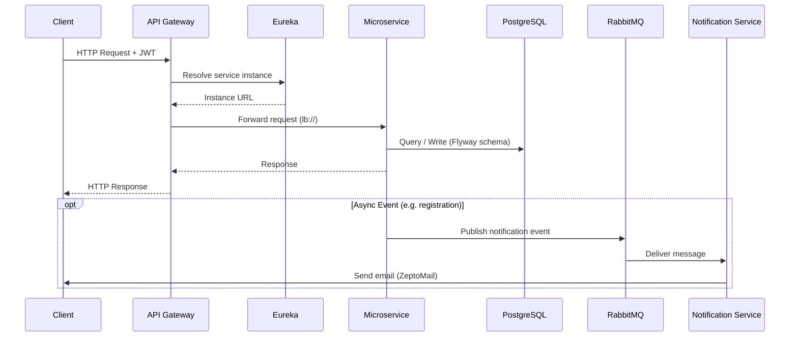

# Architecture Overview

> Last updated: 2026-07-05 | Spring Boot `3.5.3` | Java `21` | Spring Cloud `2025.0.0`

## System Context

DayQuest is a **social quest and video sharing platform** built as a Spring Boot microservices monorepo.
Users receive a daily quest, record a short video completing it, share it, and earn streaks/badges.

---

## High-Level Architecture

---

## Service Inventory

| Service | Port | DB Schema | Responsibilities |
|---|---|---|---|
| **API Gateway** | 8080 | — | Routing, rate limiting (Redis), Swagger aggregation |
| **Eureka Server** | 8761 | — | Service registry & discovery |
| **Config Server** | 8888 | — | Centralised config from GitHub / classpath |
| **User Service** | 8081 | `user_schema` | Auth (JWT), user CRUD, profile pictures (MinIO), follow system |
| **Quest Service** | 8083 | `quest_schema` | Quest CRUD, daily assignments, like/dislike, reroll |
| **Video Service** | 8085 | `video_schema` | Upload, FFmpeg thumbnails, view tracking, vote system, feed |
| **Social Service** | 8086 | `social_schema` | Threaded comments, friend requests, hashtags, blocking |
| **Content Service** | 8087 | `content_schema` | Badges, content moderation/reports, daily streaks, leaderboards |
| **Notification Service** | 8082 | — | Async email via RabbitMQ + ZeptoMail SMTP |

---

## Infrastructure Services

| Component | Image | Ports | Purpose |
|---|---|---|---|
| PostgreSQL | `postgres` (latest) | 5432 | Primary relational database, one DB (`dayquest`), multiple schemas |
| pgAdmin | `dpage/pgadmin4` | 5050 | DB admin UI |
| RabbitMQ | `rabbitmq:3-management` | 5672 / 15672 | Message broker + management UI |
| MinIO | `minio/minio` | 9000 / 9001 | S3-compatible object storage |
| Redis | `redis:7-alpine` | 6379 | Distributed caching and rate limiting |
| Prometheus | `prom/prometheus:v2.48.0` | 9090 | Metrics collection (dev only) |
| Grafana | `grafana/grafana:10.2.2` | 3000 | Metrics dashboards (dev only) |

---

## Request Flow

---

## Technology Stack

| Category | Technology | Version |
|---|---|---|
| Language | Java | 21 (Temurin) |
| Framework | Spring Boot | 3.5.3 |
| Service Mesh | Spring Cloud | 2025.0.0 |
| Auth | JWT (JJWT) | 0.11.5 |
| Resilience | Resilience4j | 2.2.0 |
| DB Migrations | Flyway | (managed by Spring Boot) |
| ORM | Spring Data JPA / Hibernate | — |
| Messaging | Spring AMQP + RabbitMQ | 3.x |
| Object Storage | MinIO Java SDK | — |
| Scheduler | ShedLock | 5.10.0 |
| Code Generation | Lombok + MapStruct | 1.18.36 / 1.5.5.Final |
| API Docs | SpringDoc OpenAPI | — |
| Build | Maven (multi-module) | 3.x |
| Containerisation | Docker + Docker Compose | — |
| CI/CD | GitHub Actions | — |

---

## Network Topology

All containers reside on the `dayquest-network` bridge network.
Services communicate by container name (internal DNS).
Only the API Gateway, Eureka, pgAdmin, RabbitMQ Management, MinIO, Grafana and Prometheus expose host ports.
