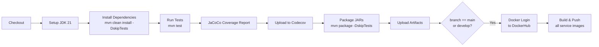

# Deployment Guide

This document describes how to deploy DayQuest using Docker Compose.

---

## Prerequisites

| Tool | Minimum Version | Notes |
|---|---|---|
| Docker | 24.x | With Docker Compose v2 plugin |
| GNU Make | 3.x | Or run docker-compose commands directly |
| Java 21 | Temurin 21 | Only needed for local builds outside Docker |
| Maven 3.x | 3.8+ | Provided via `mvnw` wrapper |

---

## Environment Configuration

There are **two** environment files:

| File | Purpose |
|---|---|
| `.env` | Docker Compose variable substitution (ports, datasource URLs) |
| `stack.env` | Runtime secrets injected into containers |

### Setup

```bash
# 1. Copy and fill the env files
cp .env.example .env
cp stack.env.example stack.env

# Edit both files with your values
notepad .env
notepad stack.env
```

### Critical Variables in `stack.env`

```env
SPRING_DATASOURCE_USERNAME=postgres
SPRING_DATASOURCE_PASSWORD=<strong-password>

JWT_SECRET=<min-64-char-hex-string>

RABBITMQ_USER=admin
RABBITMQ_PASSWORD=<strong-password>

MINIO_ACCESS_KEY=minioadmin
MINIO_SECRET_KEY=<strong-password>

MAIL_USERNAME=<smtp-user>
MAIL_PASSWORD=<smtp-password>

GRAFANA_PASSWORD=<strong-password>

REDIS_PASSWORD=<strong-password>
CORS_ALLOWED_ORIGINS=https://dayquest.de,https://app.dayquest.de
```

---

## Build

```bash
# Build all Docker images (from root of the monorepo)
make build

# Or manually:
docker-compose --env-file stack.env -f docker-compose.dev.yml build
```

The images are tagged `dayquest/<service-name>:latest` locally.

### Maven Build (without Docker)

```bash
# Build and install all modules (skip tests for speed)
./mvnw clean install -DskipTests

# Build a specific service
./mvnw clean package -pl video-service -am -DskipTests
```

---

## Running the Stack

### Development Mode

Includes monitoring services (Prometheus + Grafana) and more relaxed health checks.

```bash
make dev
# Equivalent to:
docker-compose --env-file stack.env -f docker-compose.dev.yml up -d
```

### Production Mode

Leaner stack without monitoring services.

```bash
make prod
# Equivalent to:
docker-compose --env-file stack.env -f docker-compose.yml up -d
```

### Startup Order

The compose files enforce health-check dependencies:

```
PostgreSQL (healthy)
    └── Config Server (started)
        └── Eureka Server (healthy)
            └── Business Services (user, quest, video, social, content, notification)
                └── API Gateway
```

Expect ~60–90 seconds before all services are healthy on first boot.

---

## CI/CD Pipeline

DayQuest uses GitHub Actions (`.github/workflows/ci-cd.yml`).

### Triggers

| Event | Branches |
|---|---|
| `push` | `main`, `develop` |
| `pull_request` | `main`, `develop` |
| `workflow_dispatch` | Manual trigger |

### Pipeline Stages



### Docker Image Tags

Images are pushed to DockerHub as:
```
dayquest/<service-name>:<branch-name>
```

For example, a push to `main` produces:
```
dayquest/user-service:main
dayquest/quest-service:main
dayquest/video-service:main
...
```

---

## Deploying a New Version

### Rolling Update (Docker Compose)

```bash
# Pull updated images
docker-compose --env-file stack.env -f docker-compose.yml pull

# Recreate only changed services (zero-downtime where possible)
docker-compose --env-file stack.env -f docker-compose.yml up -d --no-deps <service-name>

# Example: deploy only user-service
docker-compose --env-file stack.env -f docker-compose.yml up -d --no-deps user-service
```

### Full Stack Restart

```bash
make down
make prod
```

---

## Stopping the Stack

```bash
make down
# Equivalent to:
docker-compose --env-file stack.env -f docker-compose.dev.yml down
```

To also remove volumes (⚠ destroys all data):
```bash
make clean
```

---

## Health Verification After Deployment

```bash
# Check all containers are running
docker ps --format "table {{.Names}}\t{{.Status}}"

# Hit the API Gateway health endpoint
curl http://localhost:8080/actuator/health

# Check Eureka dashboard
open http://localhost:8761

# Verify Swagger UI
open http://localhost:8080/swagger-ui.html
```
